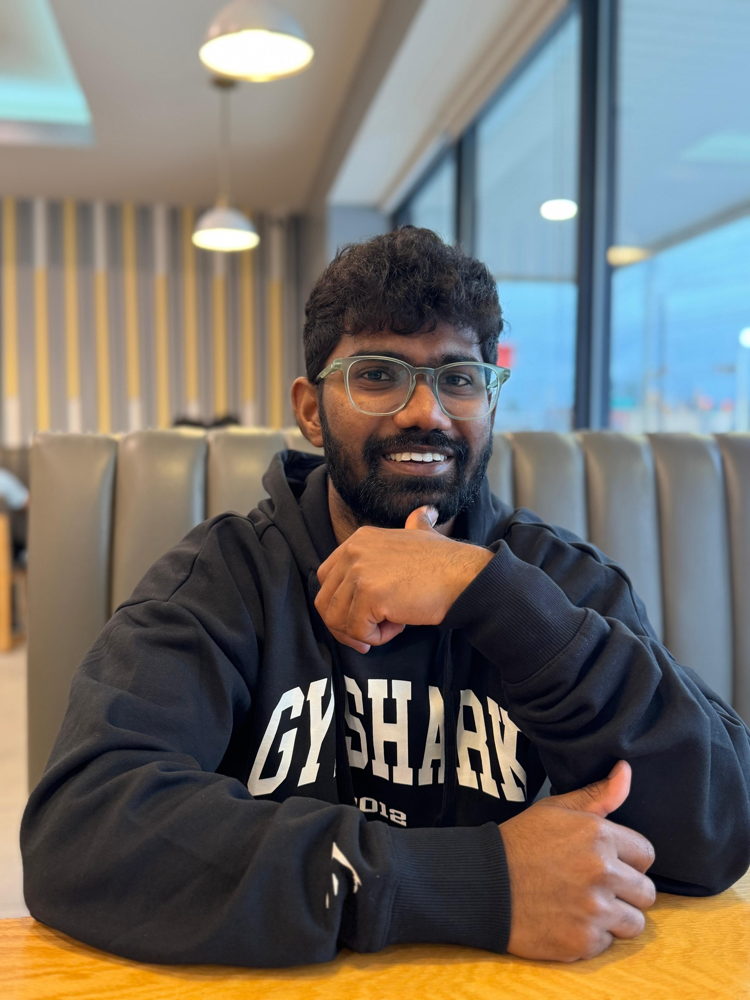

<p align="center">
  
</p>

## 👋 Hi there, I'm Tarun Madaraboina

---

## 💡 Motto
*"Good code is its own best documentation." - Steve McConnell*

---

## 🧠 About Me

```python
class TarunMadaraboina:
    def __init__(self):
        self.education = [
            "M.S. Computer Science, Rowan University (GPA: 3.7)",
            "B.Tech Electronics & Communication, JNTU (GPA: 8.21)"
        ]
        self.skills = {
            "Salesforce": ["Apex", "Administration", "SOQL", "Flows"],
            "Programming": ["Python", "Java", "SQL", "PLSQL"],
            "Web": ["HTML", "CSS"],
            "Testing": ["Manual Testing", "Selenium"],
            "Cloud": ["Azure"],
            "Databases": ["MySQL", "MongoDB", "NoSQL"]
        }
        self.current_goal = "Graduating with M.S. in December 2025"

    def motto(self):
        return "Building efficient solutions with clean code and robust testing"
```

---

## 👨‍💻 Developer Mantra

- 🥗 Eat  
- 😴 Sleep  
- 👨‍💻 Code  
- 🔁 Repeat  

---

## 🚀 Tech Arsenal

```python
def my_skills():
    return {
        "Salesforce Ecosystem": ["Apex", "SOQL", "Flows", "LWC"],
        "Cloud": ["Azure", "AWS (Learning)"],
        "Languages": ["Python", "Java", "SQL", "HTML/CSS"],
        "Databases": ["MySQL", "MongoDB", "Advanced DB Systems"],
        "QA Tools": ["Selenium", "Jira", "Test Automation"]
    }
```

---

## 🎓 Education

| Institution      | Degree                            | GPA  | Timeline            |
| ---------------- | --------------------------------- | ---- | ------------------- |
| Rowan University | MS Computer Science               | 3.7  | Dec 2025 (Expected) |
| JNTU             | BTech Electronics & Communication | 8.21 | May 2020            |

---

## 💻 Technical Skills

**Core Competencies**  
- Salesforce: Apex, SOQL, Flows, LWC  
- Programming: Python, Java, SQL, HTML/CSS  
- Testing: Selenium, Jira, Manual & Automation  
- Databases: MySQL, MongoDB, NoSQL  
- Cloud: Azure, AWS (Learning)

---

## 💼 Professional Journey

### ⚡ Salesforce Apex Developer @ TCS *(Mar 2023 - Sep 2023)*
- Boosted payment success rates by **15%** with optimized Apex triggers  
- Integrated payment gateways via **REST/SOAP APIs** (Stripe, Fifth-third)  
- Reduced API latency by **20%** through SOQL optimization  
- Enhanced data accuracy by **25%** with custom validation rules  

### 🛠️ Salesforce Administrator @ TCS *(Feb 2022 - Mar 2023)*
- Built intelligence dashboards for real-time payment tracking  
- Reduced payment failures by **40%** through RCA  
- Managed security configurations for 100+ users  

### 🔍 Quality Assurance Engineer @ TCS *(Mar 2021 - Feb 2022)*
- Automated 50+ test cases using Selenium/Python  
- Mentored 15+ new hires in testing methodologies  
- Managed end-to-end testing for 5 major releases  

---

## 🧪 Project Showcase

### 📚 Student Database Management System
- Designed normalized schemas for efficient data storage  
- Implemented automated triggers for data management  
- 🔗 [Live Demo](http://elvis.rowan.edu/~Madara24/advanceddatabases/finalproject/)

### 🤖 Embedded Robotics Solution
- Developed wireless control system using 8051 microcontrollers  
- Integrated hardware and software components  

---

## 🏆 Achievements

```diff
+ Special Achievement Award @ TCS (2022)
+ Applause Award @ TCS (2022)
+ NCL Spring 2024 Certification
```

---
