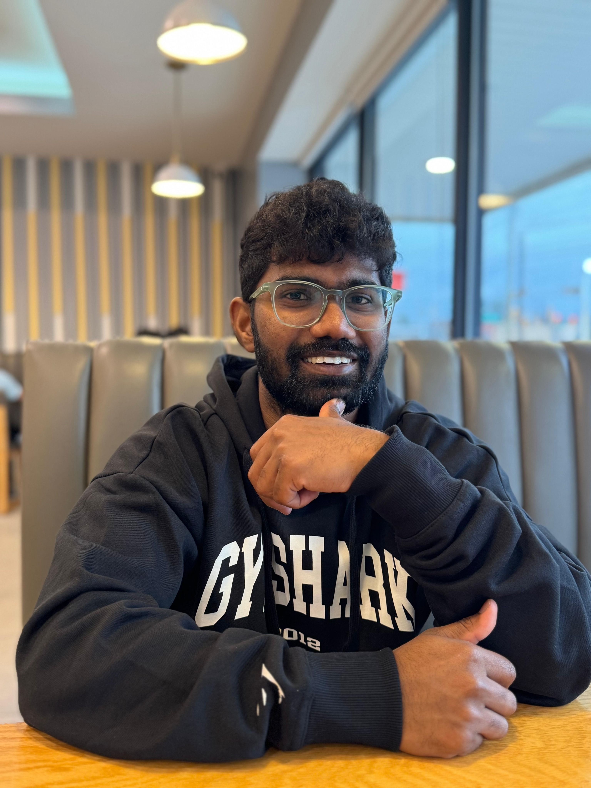

<h1 align="center">Hey there, I'm Tarun Madaraboina 👨‍💻</h1>

  

  <em>
    Passionate about turning 💡 ideas into elegant solutions. 
    A curious tech explorer 🚀 focused on building scalable, secure systems in the cloud 🌩️.
  </em>

---

### 📫 How to reach me

  
  
  

---

### 🔧 My Toolbox

| Category       | Tools & Languages |
|----------------|------------------|
| 🛠️ Languages    | `Python`, `Java`, `SQL`, `HTML`, `CSS`, `PLSQL` |
| ☁️ Cloud & DevOps | `Azure`, `AWS (learning)`, `Salesforce`, `REST/SOAP APIs` |
| 🧪 QA & Testing | `Selenium`, `Jira`, `Manual Testing`, `Test Automation` |
| 💾 Databases    | `MySQL`, `MongoDB`, `NoSQL`, `Advanced DB Systems` |
| 🎯 CRM Tools    | `Apex`, `SOQL`, `LWC`, `Flows`, `Admin Config` |

---

### 🛠️ Work Experience

**Software engineer / Salesforce Developer** @ TCS (2021-2023)
- ⚡ Improved payment success rate by 15% through trigger optimization  
- 🌐 Built & integrated APIs (Stripe, Fifth-third)  
- 📊 Boosted performance by optimizing SOQL and custom validations  
- 🔐 Configured security roles for 100+ users  
- 📉 Reduced payment failures by 40% via RCA workflows  

- 🤖 Automated 50+ test cases using Selenium  
- 👥 Mentored 15+ new hires in QA fundamentals

---

### 🚀 Projects

**📚 Student DBMS (MySQL, Web)**  
Built a full-stack database application with real-time triggers  
[🔗 Demo](http://elvis.rowan.edu/~Madara24/advanceddatabases/finalproject/)

**🤖 Embedded Robotics (8051 MCU)**  
Created a wireless robotic control interface using microcontrollers and C

---

### 📈 GitHub Stats

  
  

---

### 🎓 Education

| Degree | Institution | GPA | Year |
|--------|-------------|-----|------|
| MS in Computer Science | Rowan University | 3.7 | Dec 2025 (Expected) |
| B.Tech in ECE | JNTU | 8.21 | 2020 |

---

### 🏆 Achievements

- 🥇 Special Achievement Award – TCS 2022  
- 👏 Applause Award – TCS 2022  
- 💻 NCL Spring 2024 Cybersecurity Certification  

---

### 🎨 Fun Fact
> I code better with music, coffee, and a bit of chaos ☕🎧

---

